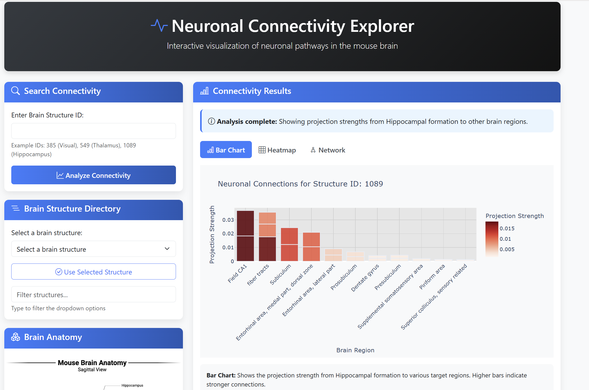
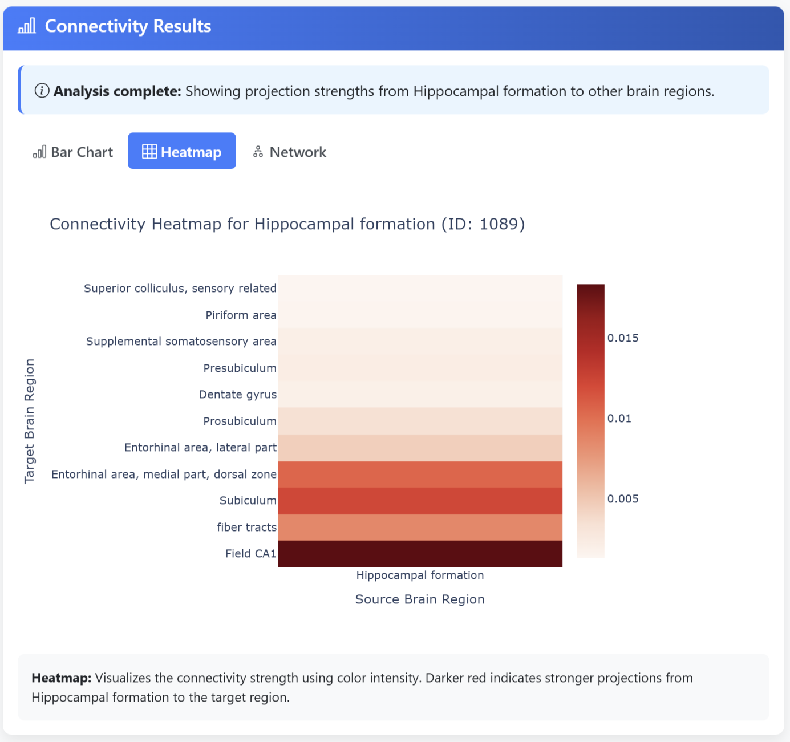
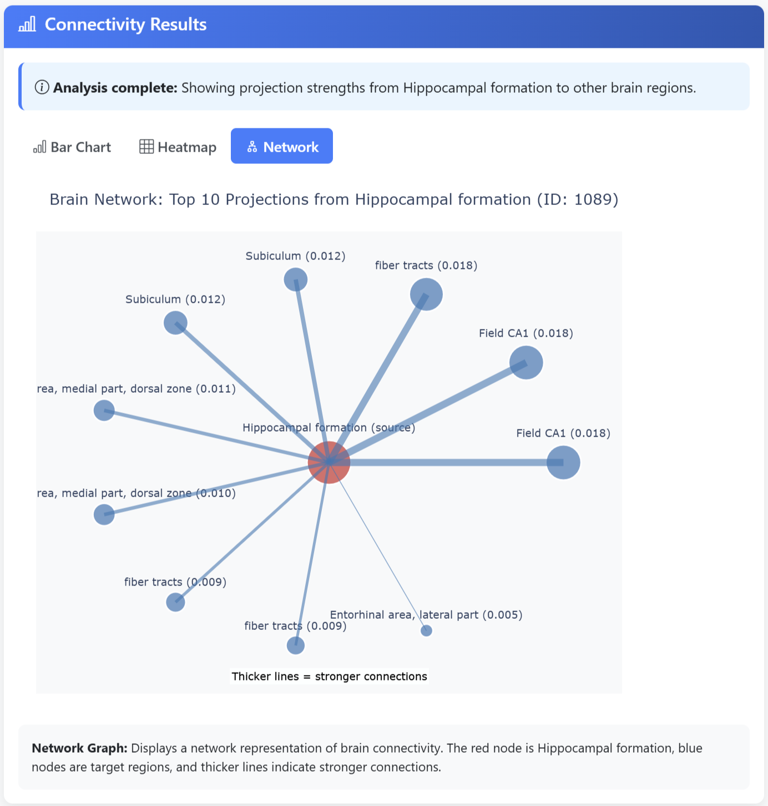
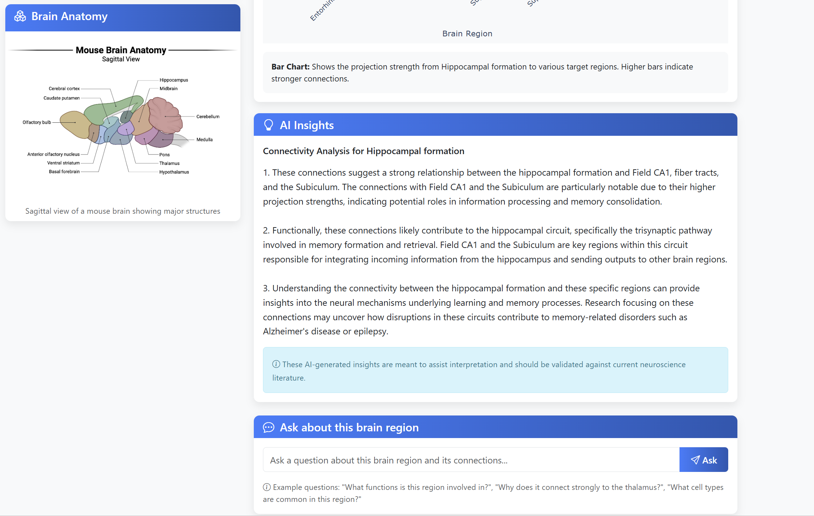
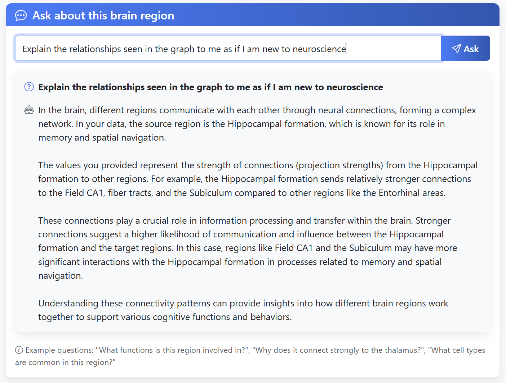

# Neuronal Connectivity Explorer
## 📺 Watch a Live Demo Here!

[](https://www.youtube.com/watch?v=GDvpaCxxzcs)

This is a lightweight, AI-enhanced web application for visualizing mouse brain connectivity using data from the [Allen Mouse Brain Connectivity Atlas](https://connectivity.brain-map.org). It allows users to explore neuronal projections from a given brain region and receive concise, AI-generated insights on neural function and circuitry.

Built using Python, Flask, Plotly, and OpenAI’s GPT API, this project reflects my ongoing interest in building accessible scientific tools that translate large biological datasets into usable knowledge.

<div align="center">
  
</div>

---

## Why This Project?

Across multiple academic and personal projects, I’ve found immense value in making complex datasets — from infrared spectroscopy and protein structures to rental markets — both **explorable** and **understandable**.

This project continues that theme by transforming connectivity data into interactive visualizations and interpretable summaries. It reflects my belief that tools should not just present information — they should **guide insight**, **improve accessibility**, and **support exploration** across a range of users.

---

## Features

- **Interactive Visualizations**  
  Bar charts, heatmaps, and network graphs make it easy to compare projection strengths between brain regions.
  
  <div align="center">
    
    
  </div>

- **AI-Generated Tooltips**  
  Uses OpenAI GPT to generate concise 1–2 sentence descriptions of mouse brain regions, cached locally via SQLite.
  
  <div align="center">
    
  </div>

- **Natural Language Query Interface**  
  Users can type questions like _"Why does this area project to the thalamus?"_ and receive context-aware answers.
  
  <div align="center">
    
  </div>

- **Modular, Reusable Backend Components**  
  Code is structured for easy reuse in other biological or anatomical datasets.

- **Local Caching System**  
  Caches AI responses to reduce API use and improve performance.

---

## Project Philosophy

This project embodies a theme common to much of my work: **taking complex scientific or real-world data and turning it into systems people can interact with**.

From visualizing protein behavior with ROSETTA to scraping real-time rental data and building property filtering tools with React and Leaflet, I’ve consistently gravitated toward building tools that bridge the gap between raw data and practical decision-making.

---

## Tech Stack

| Layer       | Technology                     |
|-------------|--------------------------------|
| Backend     | Python, Flask, SQLite (Cache)  |
| Frontend    | HTML, Bootstrap, Plotly.js     |
| AI/Insight  | GPT-3.5-Turbo                  |
| Data Source | Allen Mouse Brain Atlas, AllenSDK |

---

## Quick Start

### 1. Clone the Repo

```bash
git clone https://github.com/NahomAzmach/neuronal-connectivity-explorer.git
cd neuronal-connectivity-explorer
```
#### Option A: Using PIP
### 2. Create and Activate a Virtual Environment

```bash
python -m venv venv
source venv/bin/activate  # or venv\Scripts\activate on Windows
```
### 3. Install Dependencies

```bash
pip install -r requirements.txt
```
#### Option B: Using Conda
```bash
# Create and activate a conda environment
conda create -n neuro_connectivity python=3.9
conda activate neuro_connectivity

# Install core packages through conda
conda install -c conda-forge flask pandas numpy plotly

# Install remaining packages through pip
pip install markupsafe openai==0.28.1 allensdk
```
### 4. Set Your API Key 

```bash
export OPENAI_API_KEY="YourOpenAIKey" #on mac or Linux
set OPENAI_API_KEY="YourOpenAIKey"  # On Windows
```

### 5. Run the app
```bash
python neuronal_connectivity.py
```

Then visit: 
```bash
http://127.0.0.1:5000
```

## Folder Structure
```bash
neuronal-connectivity-explorer/
├── app/
│   └── neuronal_connectivity.py
├── templates/
│   └── index.html
├── static/
|   └── structures.csv (List of all the brain structures)
│   └── images/
│       └── mouseBrainPic.png
|       └──AI1.png
|       └──AI3.png
|       └──heatMap.png
|       └──barGraph.png
├── requirements.txt
├── README.md
├── .gitignore
```

## Example Use Case

**A user inputs the ID of a brain structure (e.g., hippocampus) and receives:**

* Visual projections to other regions
* Functional explanations of each region
* AI-generated insight into the structure's role and network connectivity

**They can ask questions like:**

"What is this structure’s function?"
"Why is it connected to the thalamus?"
"What kind of circuits does this pattern suggest?"


## Related Projects
**Rental Property Aggregator (AWS-Backed, Full Stack)**
Identified a local housing pain point and built a scalable solution:
A Node.js/React-based platform that consolidates listings from two major rental websites into a single, user-friendly interface.

**Key features include:**

- Real-time filtering by price and location
- Interactive map visualization with Leaflet
- Cloud migration to AWS EC2, with DynamoDB for scalable storage of property listings
- Automatically updates listing data on schedule using headless scraping tools and AWS EventBridge
- This project reflects my passion for turning fragmented, big datasets into tools that support transparency, accessibility, and better decision-making.

## About Me
I’m a computer science upcoming graduate with strong interests in scientific computing, data accessibility, and front-end/backend tool development. I love projects that turn big, messy datasets into interactive, elegant systems — especially when they support real-world exploration, equity, and discovery. I have also recieved a minor in Biology and Chemistry.

## Resources

- [Allen Brain Map](https://portal.brain-map.org/)
- [Allen SDK Documentation](https://allensdk.readthedocs.io/)
- [Mouse Brain Connectivity Atlas](https://connectivity.brain-map.org/)
